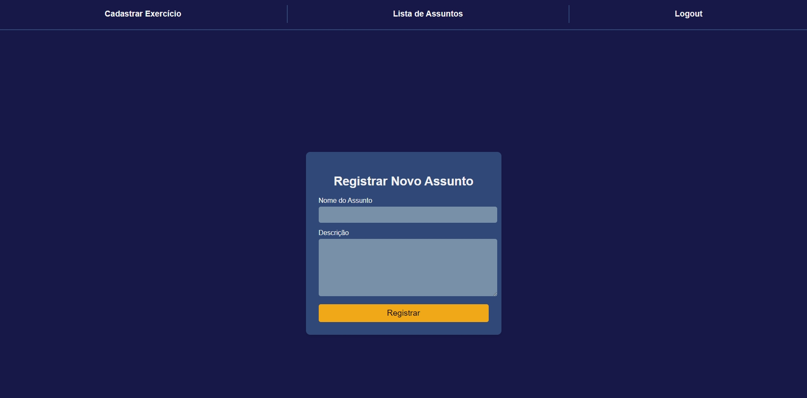
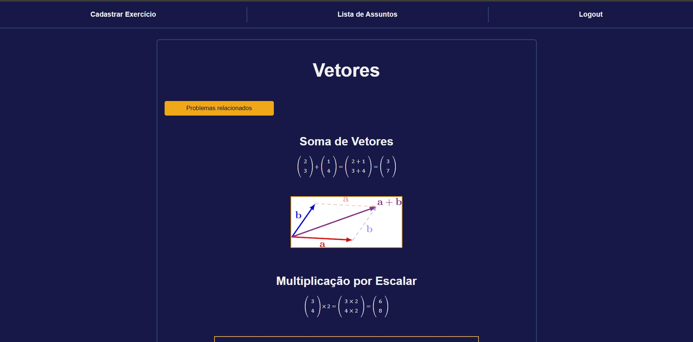
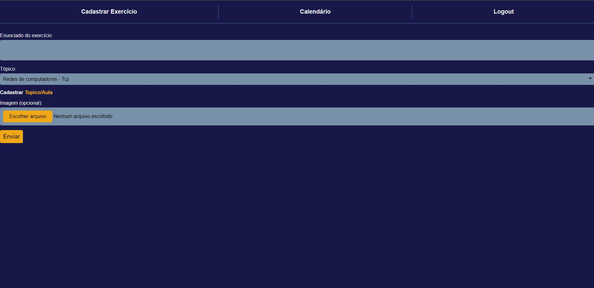
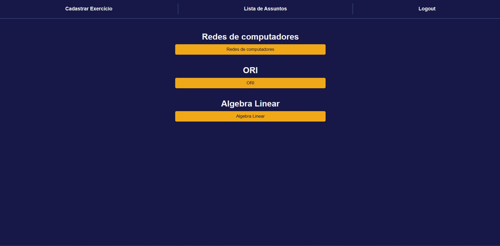
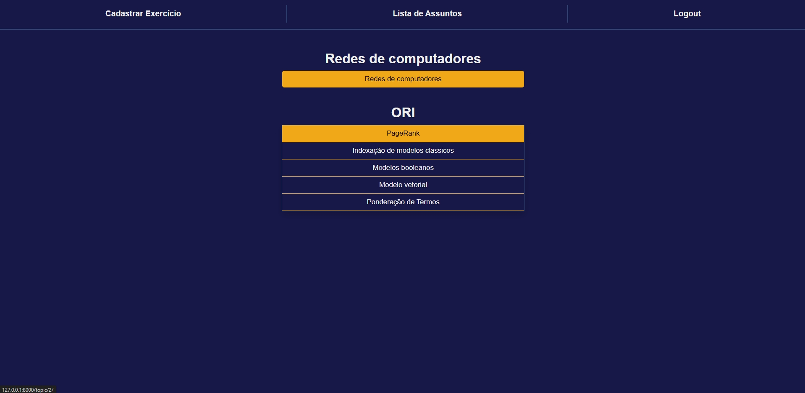
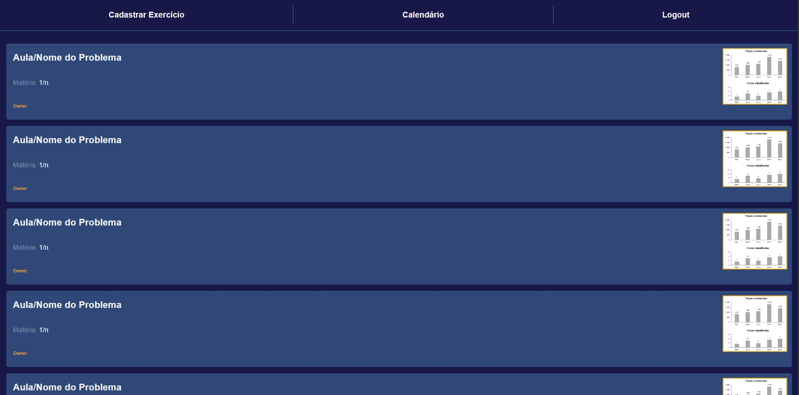
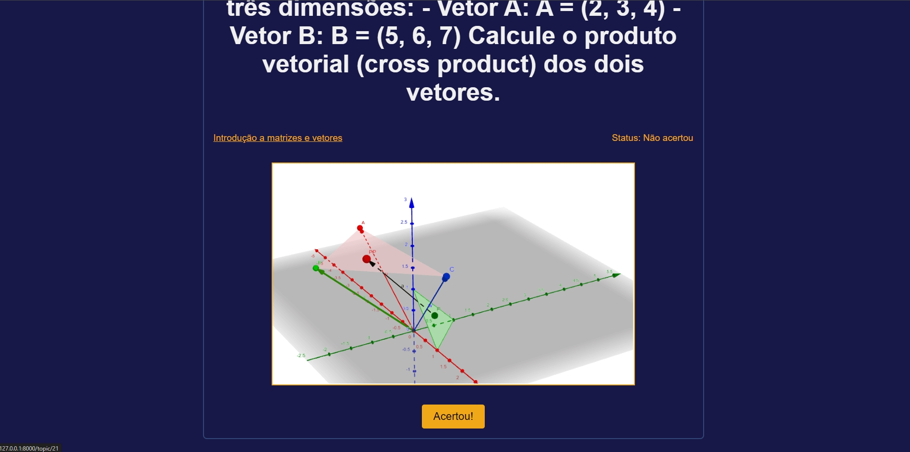
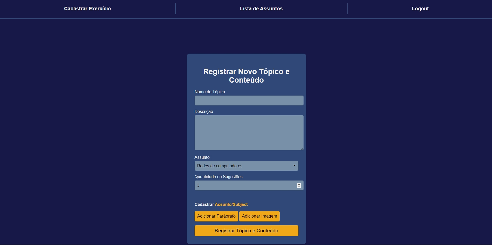

# Sistema de Recomendação para Aprendizagem Espaçada

Este projeto é uma plataforma que auxilia os usuários a aprimorarem o aprendizado através da técnica de *aprendizagem espaçada*. O sistema sugere revisões e exercícios no momento ideal para otimizar a retenção de conteúdo, com base na curva do esquecimento. Os usuários podem cadastrar suas próprias matérias e tópicos, criando uma experiência de estudo personalizada e dinâmica.

## Funcionalidades Principais

- **Cadastro de Assuntos e Tópicos**: Os usuários podem adicionar novos assuntos, como "Álgebra Linear", que podem ser utilizados para organizar matérias acadêmicas ou de estudo pessoal. Cada assunto pode ser subdividido em tópicos específicos. Por exemplo, um assunto como "Álgebra Linear" pode conter um tópico sobre "Introdução a Vetores", que inclui explicações sobre operações como soma e multiplicação de vetores.
  
  

- **Anotações em Tópicos**: Dentro dos tópicos, o usuário pode criar anotações que aceitam código HTML, facilitando a formatação personalizada de conteúdos. Essas anotações são criadas de forma dinâmica no momento do cadastro do tópico. Um exemplo de anotação seria uma breve explicação de conceitos abordados em uma aula de até duas horas.
  
  

- **Cadastro e Sugerimento de Exercícios**: O sistema permite o cadastro de exercícios relacionados aos tópicos. Esses exercícios são sugeridos automaticamente com base na curva de aprendizagem do usuário. Ao resolver um exercício, o usuário pode marcá-lo como correto, evitando que ele seja sugerido novamente, caso tenha sido resolvido com sucesso.
  
  

- **Página de Listagem de Assuntos e Tópicos**: Uma página dedicada exibe uma lista de todos os assuntos cadastrados, com um menu suspenso (dropdown) que permite a seleção dos tópicos associados. Assim, o usuário pode navegar facilmente entre os conteúdos e revisar os tópicos relevantes.

  
  

## Interface de Usuário

O projeto inclui uma interface intuitiva e amigável, onde os usuários podem:
- Cadastrar novas matérias e tópicos.
- Acessar as recomendações de revisão de exercícios com base no seu progresso.
- Revisar conteúdos e tópicos cadastrados de forma organizada e clara.

Abaixo, algumas capturas de tela ilustrando a interface:

### Página Inicial

### Página de Exercícios

### Página de Cadastro de Tópico

## Próximas Implementações
- Fazer exercícios aceitarem HTML
