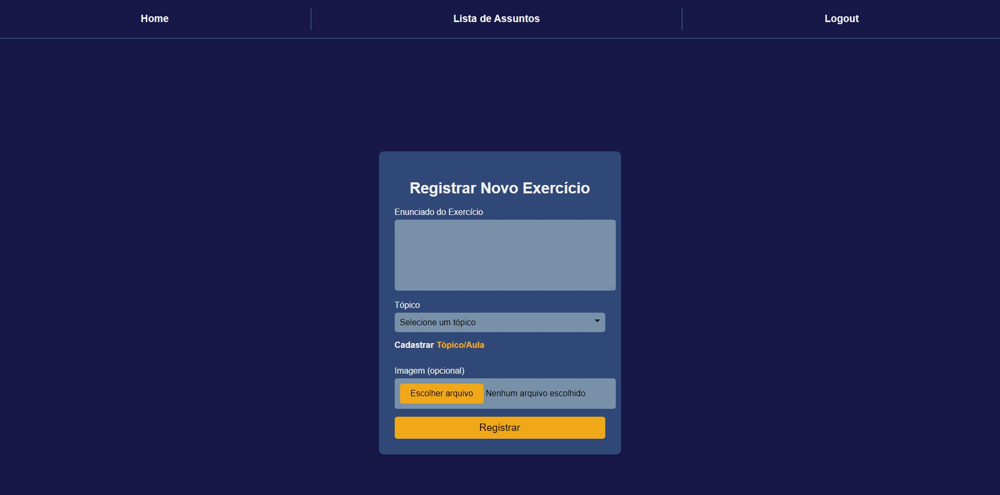

# Projeto de Aprendizado Espaçado

Este projeto é uma plataforma que auxilia os usuários a manterem o conteúdo estudado de forma mais eficaz, utilizando técnicas baseadas na curva do esquecimento. O site recomenda exercícios de revisão conforme o progresso de cada usuário. Os usuários podem cadastrar suas próprias matérias, aulas e exercícios, recebendo recomendações de revisão alinhadas aos seus estudos.

## Home

## Exercício

## Cadastro de Assunto

## Lista de Assuntos

## Hover na Lista de Assuntos

## Cadastro de Exercício

## Tópico - Anotações

## Cadastro de Tópico

A imagem da página inicial ilustra a interface amigável que permite aos usuários cadastrar suas matérias, acompanhar recomendações e acessar exercícios de revisão. Cada funcionalidade visa otimizar o processo de aprendizado e revisão.

## Funcionalidades

- **Cadastro de Matérias, Aulas e Exercícios**: Os usuários podem criar e gerenciar seus próprios materiais de estudo e exercícios personalizados.
- **Recomendações Baseadas no Aprendizado Espaçado**: O sistema sugere exercícios no momento ideal de revisão para melhorar a retenção de informações.
- **Exercícios Personalizados**: Os usuários podem resolver e revisar exercícios cadastrados, ajustados de acordo com suas necessidades.

## Próximas Implementações

[Deixe esta seção em aberto para futuras atualizações.]
